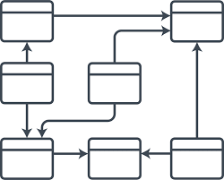
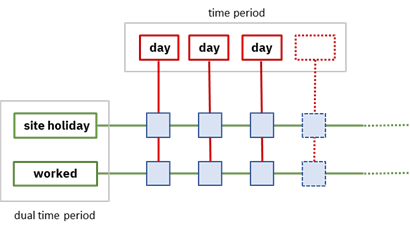

 

# Using a dual model for expressivity and performance 

This repo shows how using a dual view on an object model can improve the expressivity and performance of business decisions defined with business rules.

The example implemented is loosely based on worker compensation / benefits calculation: a worker is associated with a time period that captures different characteristics for each day in that period, such as whether the day is a site holiday or the worker has worked on that specific day. A simple object model for the rules can rely on a class that represents a Day with one attribute for each characteristic and create a Day instance for each day in the time period.

The issue with such a design is that it leads to:

- Quasi-linear degradation of the runtime performance as the number of days in the considered time period is increasing.

- Lower expressivity as most of the operations performed by the rules are about computing aggregated values on the time period.

This is when taking a dual point of view on the model is useful. In our example, instead of using a list of day instances that are characterized by a set of properties, we can choose to use a set of properties that are characterized by the set of days to which they apply. This idea is illustrated by the figure below:

- The red outline shows the simple model, where the days are entities with properties such as site holiday or worked and a decision service execution involves potentially thousands of instances of day entities. 

- The green outline is the dual model, where property objects capture the property values for each day. Here, there’s only a handful of property objects to manage.
 
Once the dual view is adopted, an optimized implementation can be selected. In our example, the collection of boolean values for a property can be efficiently represented using a Java Bitset. Such an implementation is compact in memory and allows to perform batch logical operations on properties.

For categorical (non-boolean) properties, we can keep a bit-set implementation by using technique such as one-hot encoding, commonly used for machine learning models.

The projects in this repo are based on ODM 8.10.4.
